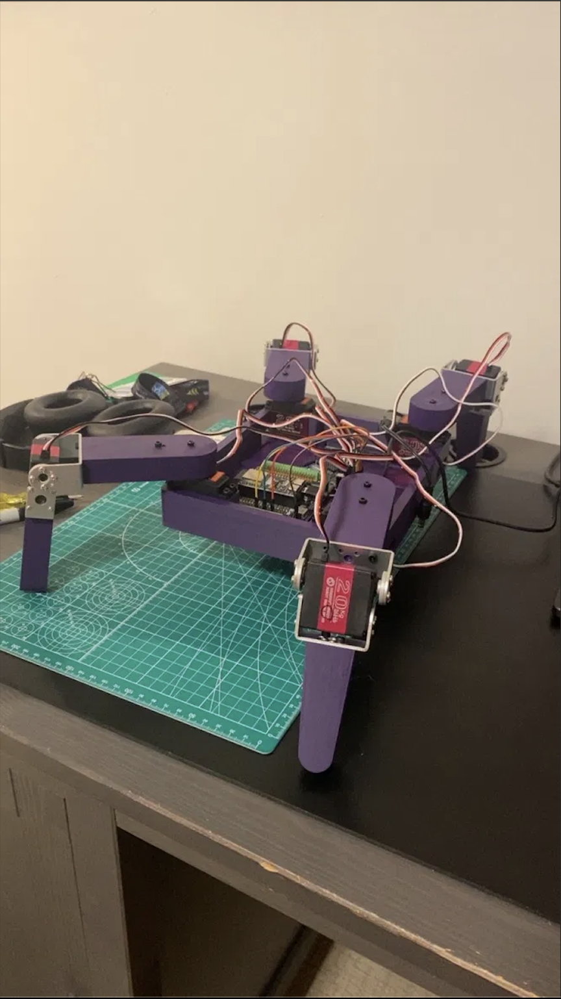
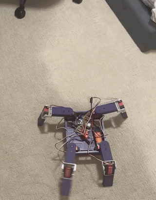

# Gordo — 4-Legged Walking Quadruped Robot

A personal summer project: a fully custom quadruped walking robot with WiFi-based web controller, trot gait, and 2-DOF legs.



---

## It Walks — First Untethered Gait (Prototype)

**Status: very rough prototype. The gait is still being tuned and the feet are still being designed.**



Full clip: [media/gordo_walk_prototype.mp4](media/gordo_walk_prototype.mp4)

First run walking under its own power on carpet. It moves, and that is about all that can be
claimed for it right now — the motion is a slow shuffle rather than a clean trot.

What is visibly wrong, and what is being worked on:

- **Gait timing** — swing and stance phases are not cleanly separated, so multiple legs are
  loaded at once and the body drags instead of stepping. Trot phasing (FL+RR / FR+RL) is being
  re-tuned rather than treated as done.
- **Stride and lift height** — swing legs are not clearing the carpet by enough, so they scuff
  through the stroke and scrub away most of the forward travel.
- **Feet** — the legs currently end in bare flat printed shanks with no foot at all. On carpet
  they slide badly and there is no contact compliance. Actively experimenting here: rubber
  tips, domed/ball feet, and a compliant (springy) foot are all on the bench to be tried.
- **Body attitude** — the chassis pitches and yaws through the stroke instead of holding level,
  which is partly gait timing and partly no ground-contact feedback.

Everything above is expected at this stage. The point of this run was to prove the full chain —
battery → buck → PCA9685 → 8 servos → gait loop — actually drives the robot across the floor.
Gait quality comes next.

---

## Current Status

- [x] CAD complete (Onshape)
- [x] All parts received
- [x] Hardware fully assembled
- [x] All 8 servos calibrated and tested
- [x] Wiring schematic complete (KiCad)
- [x] WiFi web controller built
- [x] Power supply wiring — running untethered off the 2S LiPo
- [x] Firmware — PCA9685 init and servo sweep
- [x] **First walking prototype — moves under its own power (rough)**
- [ ] Firmware — trot gait engine (prototyping; timing and stride still being tuned)
- [ ] Feet — design and test (currently bare printed leg ends, slipping on carpet)
- [ ] Firmware — inverse kinematics
- [ ] Firmware — web controller integration

> Note: the gait code driving the clip above is still bench-iteration and has not been
> committed yet. `firmware/gait/` still holds the earlier skeleton and will be replaced once
> the timing is worth keeping.

---

## Hardware

| Component | Part | Notes |
|---|---|---|
| Microcontroller | ESP32-S3 Freenove + Breakout Board | WiFi AP hosted on-board |
| Servo Driver | PCA9685 PWM board | I2C address 0x40 |
| Servos | 8x DS3218 20kg | 2 DOF per leg, hip + knee |
| Battery | DLG 7.4V 2200mAh 2S 30C LiPo | Dean's T connector |
| Buck Converter (x2) | XINGYHENG 20A 300W | 7.4V in — one to 3.3V logic, one to 5V servo |
| Capacitor | 2200uF 10V electrolytic | Across PCA9685 V+ and GND |
| Connectors | Elechawk Dean's T pigtails 14AWG | Battery to buck converter inputs |
| Charger | B3 2S balance charger | Charges via JST-XH balance port |
| CAD | Onshape | Fully modelled and finalized |

---

## Leg Configuration

4 legs, 2 DOF each (hip + knee). All servos driven by PCA9685 over I2C.

| Channel | Leg | Joint |
|---|---|---|
| 0 | Front Left | Hip |
| 1 | Front Left | Knee |
| 2 | Front Right | Hip |
| 3 | Front Right | Knee |
| 4 | Rear Left | Hip |
| 5 | Rear Left | Knee |
| 6 | Rear Right | Hip |
| 7 | Rear Right | Knee |

---

## Wiring

I2C: GPIO8 (SDA), GPIO9 (SCL) on ESP32-S3 to PCA9685

Power architecture:
- 2S LiPo → Buck 1 (3.3V) → ESP32 VIN
- 2S LiPo → Buck 2 (5V) → PCA9685 V+ (servo rail)
- All grounds common
- 2200uF capacitor across PCA9685 V+ and GND

Full schematic: [hardware/Gordo-Wiring.pdf](hardware/Gordo-Wiring.pdf)

---

## Software Stack

- C++ via Arduino IDE
- PCA9685 via Adafruit PWM Servo Driver library
- WiFi access point: SSID Quadruped, password robot1234
- Web controller served at 192.168.4.1
- Planned gait: trot (FL+RR move together, FR+RL move together)

### File Structure

```
firmware/
├── main.ino        — setup, loop, WiFi AP, web server routes
├── gait.h          — gait function declarations
└── gait.cpp        — trot sequencer, stance/swing logic
hardware/
└── Gordo-Wiring.pdf — KiCad wiring schematic
images/
└── build_photo.png  — assembled robot photo
media/
├── gordo_walk_prototype.gif — walking prototype, inline preview
└── gordo_walk_prototype.mp4 — walking prototype, full clip
```

---

## Web Controller

Browser-based controller served directly from the ESP32. Connect to the Quadruped WiFi network and open 192.168.4.1 in any browser.

Controls:
- D-pad: forward, back, left, right
- Rotate: CW and CCW
- Speed: slow, medium, fast
- Presets: stand, sit, wave, dance

---

## Notes

- DS3218 stall current ~2A each — 8 servos = up to 16A peak. Do not stall all simultaneously.
- Set buck converter output voltages before connecting anything.
- Servo neutral (90 deg) physically centred before mounting legs.
- PCA9685 default I2C address 0x40 — verify with I2C scanner if unresponsive.
- Never charge LiPo unattended. Use balance charger only. Storage voltage: 3.8V/cell.
- Battery cutoff: stop use at 7.0V total (3.5V/cell).
