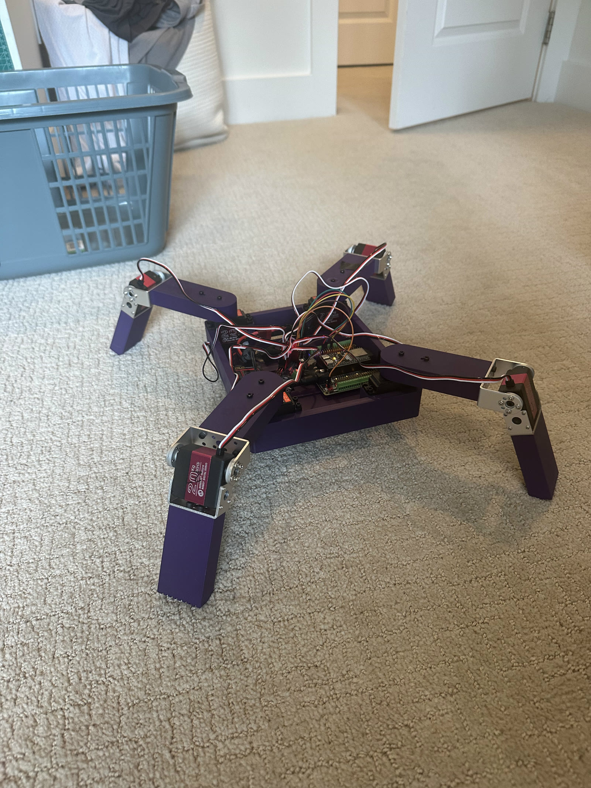
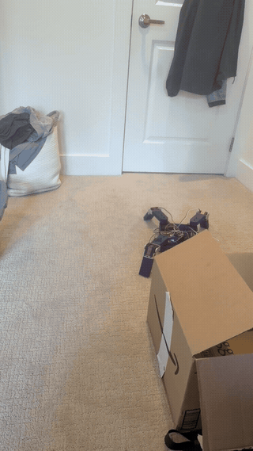

# Gordo — Completed Quadruped Robot

**Completed build · Untethered walking · WiFi control · Custom mechanical, electrical, and gait design**

Gordo is a finished eight-servo quadruped designed and built from the ground up as a personal
robotics project. The frame, wiring, firmware, browser controller, and crawl gait are all custom;
the project did not begin with a robot kit or an existing gait library.



## Final Result

Gordo walks forward and backward, turns in place, performs animated poses, and operates
untethered from a 2S LiPo. A phone or laptop controls the robot directly over its onboard WiFi
network, without an external router.



[Watch the full walking demonstration](media/gordo_walk.mp4)

## Completed Build

| Area | Final implementation |
|---|---|
| Mechanical | Custom Onshape chassis and four printed 2-DOF legs |
| Actuation | 8 × DS3218 high-torque servos, individually centered and calibrated |
| Control | ESP32-S3 with a PCA9685 16-channel PWM driver |
| Movement | Static crawl with forward, reverse, blended steering, and in-place turning |
| Interface | ESP32-hosted browser controller with joystick, emotes, and live gait tuning |
| Persistence | Tuned stride, reach, lift, and trim values saved to ESP32 flash |
| Power | 7.4 V 2S LiPo feeding the Freenove breakout and regulated servo rail |

## The Gait

Gordo's hips are yaw joints, so a planted foot naturally travels in an arc. Straight walking
requires a more nearly linear foot path: the final gait sweeps each knee in proportion to its
hip, adding the radial component that prevents the stance feet from scrubbing sideways. That
reach correction is the change that turned the original shuffle into the walk shown above.

The finished motion controller uses a static crawl:

- one foot swings while the other three remain planted;
- a trapezoidal lift profile keeps each toe clear through the full swing;
- a short all-feet-down interval separates consecutive steps;
- differential stride blends translation and turning; and
- reverse mirrors the leg sequence front-to-back to preserve the support pattern.

With two powered joints per leg, Gordo cannot actively shift its body sideways. The slow,
one-leg-at-a-time crawl is the deliberate mechanical solution: it keeps three contact points
throughout each step without requiring a third hip joint or closed-loop balance.

## Hardware

| Component | Final part |
|---|---|
| Microcontroller | Freenove ESP32-S3 WROOM and breakout board |
| Servo driver | PCA9685 at `0x40`, 50 Hz |
| Servos | 8 × DS3218, 500–2500 µs pulse range |
| Battery | DLG 7.4 V 2200 mAh 2S 30C LiPo |
| Servo-rail capacitor | 2200 µF, 10 V electrolytic |
| Charger | B3 2S balance charger |
| CAD | Finalized Onshape assembly |

### Servo channels

| Channel | Leg | Joint |
|---|---|---|
| 0 | Front Left | Knee |
| 1 | Front Left | Hip |
| 2 | Front Right | Knee |
| 3 | Front Right | Hip |
| 4 | Back Right | Knee |
| 5 | Back Right | Hip |
| 6 | Back Left | Knee |
| 7 | Back Left | Hip |

## Electrical Architecture

```text
2S LiPo
  └── Freenove ESP32-S3 breakout
      ├── ESP32-S3 ──I2C── PCA9685
      └── regulated 5 V ── PCA9685 servo rail ── 8 × DS3218
```

- I2C uses GPIO 8 for SDA and GPIO 9 for SCL.
- A 2200 µF capacitor sits across PCA9685 V+ and ground.
- The ESP32-S3, PCA9685, servo rail, and battery share a common ground.
- The complete as-built connection map is in
  [hardware/wiring_diagram.md](hardware/wiring_diagram.md).

## WiFi Controller

The ESP32-S3 creates the `QuadrupedTuner` network with password `12345678` and serves the
controller at `http://192.168.4.1`.

The controller provides:

- a drag joystick for forward, reverse, and blended steering;
- stop and stand controls;
- wave, shimmy, and worm animations; and
- live stride, reach, foot-lift, and straight-line trim controls saved to flash.

A drive timeout stops motion automatically if the browser stops sending commands.

## Firmware

The production sketch is [`firmware/servo_tuner/servo_tuner.ino`](firmware/servo_tuner/servo_tuner.ino).
It contains the gait engine, WiFi access point, browser interface, live controls, and flash-backed
settings used by the completed robot.

```bash
arduino-cli compile --fqbn esp32:esp32:esp32s3 firmware/servo_tuner
arduino-cli upload -p COM4 --fqbn esp32:esp32:esp32s3 firmware/servo_tuner
arduino-cli monitor -p COM4 --config baudrate=115200
```

The repository also includes the scripted-pose sketch and the neutral center-hold utility used
during assembly and calibration.

## Mechanical Design

The chassis, servo mounts, and articulated legs were modeled as a complete assembly in Onshape.
Each leg uses one hip-yaw servo and one knee servo for eight powered joints in total.

[Open the final Onshape assembly](mechanical/onshape_link.md)

## Repository Guide

```text
docs/                         final build and operating notes
firmware/servo_tuner/         production gait and controller firmware
firmware/quadruped/           scripted poses and motion sketch
firmware/center_hold/         servo-centering utility
hardware/wiring_diagram.md    as-built power, I2C, and channel map
images/build_photo.jpg        completed robot
mechanical/onshape_link.md    final CAD assembly
media/gordo_walk.gif          inline walking demonstration
media/gordo_walk.mp4          full walking demonstration
```

## Safe Operation

- Use the B3 balance charger through the JST-XH balance connector and never charge the LiPo
  unattended.
- Stop operation at 7.0 V total pack voltage (3.5 V per cell); store at 3.8 V per cell.
- Keep all grounds common and confirm the 2200 µF servo-rail capacitor polarity before power-up.
- Avoid commanding all eight servos against a mechanical stop simultaneously.

## Project Status

**Complete.** Mechanical design, fabrication, assembly, wiring, calibration, gait development,
wireless control, and untethered walking were completed and demonstrated. This repository is
the final build record and working source archive for Gordo.
